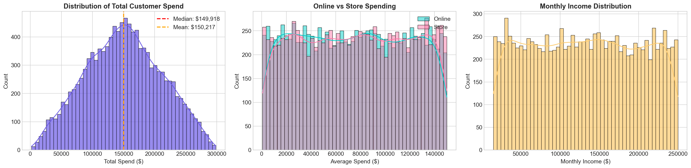
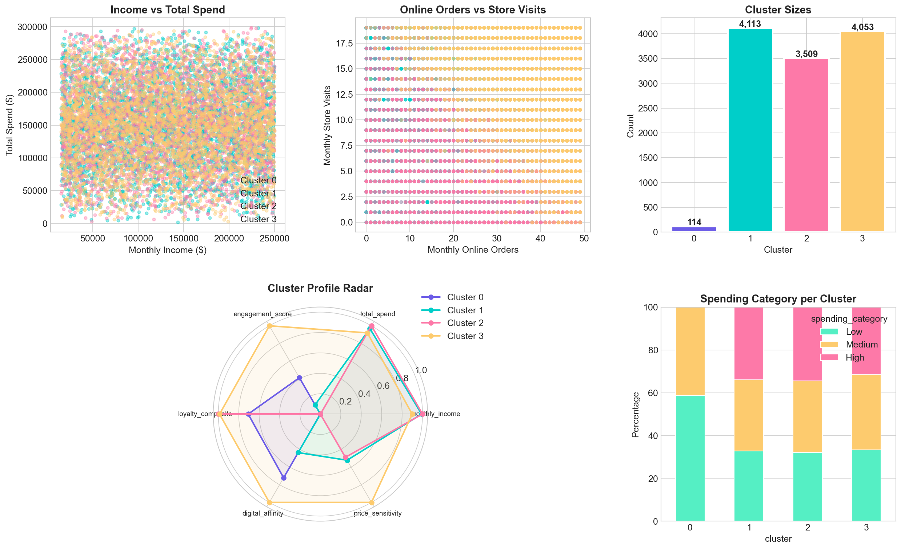
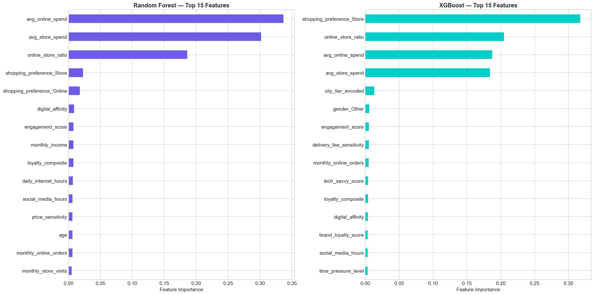
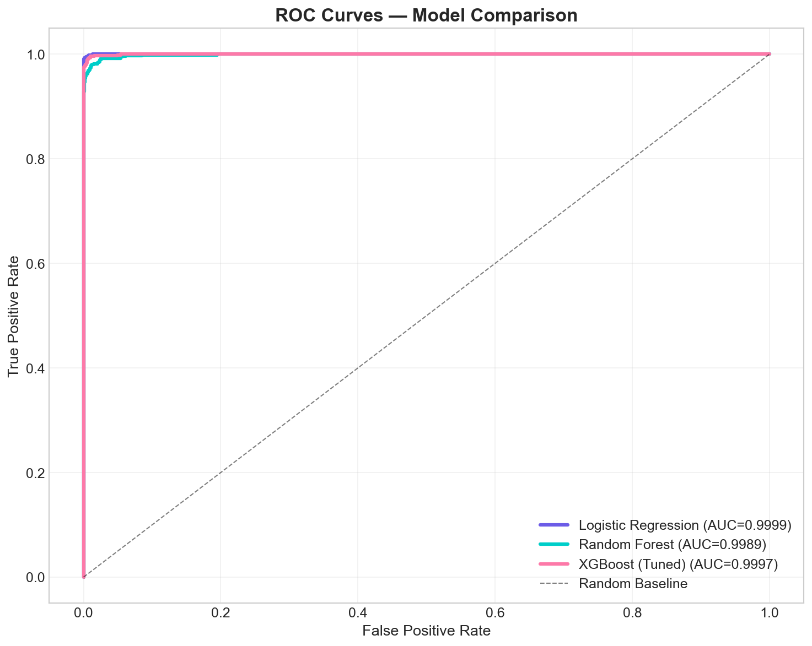

<div align="center">

# 🛍️ Consumer Shopping Trends Analysis

### Customer Segmentation & Spending Prediction

[](https://python.org)
[](https://jupyter.org)
[](https://scikit-learn.org)
[](https://streamlit.io)

*A complete, industry-level data science project that identifies customer segments and predicts high-value customers to help businesses improve targeting, retention, and revenue.*

[📓 View Notebook](#-analysis-notebook) · [📊 Dashboard](#-interactive-dashboard) · [💡 Key Insights](#-key-insights)

</div>

---

## 📋 Table of Contents

- [Project Overview](#-project-overview)
- [Business Problem](#-business-problem)
- [Dataset](#-dataset)
- [Project Structure](#-project-structure)
- [Installation & Setup](#-installation--setup)
- [Analysis Pipeline](#-analysis-pipeline)
- [Key Insights](#-key-insights)
- [Model Performance](#-model-performance)
- [Interactive Dashboard](#-interactive-dashboard)
- [Business Recommendations](#-business-recommendations)
- [Technologies Used](#-technologies-used)

---

## 🎯 Project Overview

This project applies the full **data science lifecycle** to consumer shopping data, delivering actionable business intelligence through:

1. **Customer Segmentation** — K-Means clustering to identify 4 distinct customer groups
2. **High-Spender Prediction** — ML models (Logistic Regression, Random Forest, XGBoost) to predict high-value customers
3. **Business Intelligence** — Data-backed recommendations for marketing, retention, and revenue optimization

---

## 💼 Business Problem

| # | Key Question | Business Impact |
|---|-------------|-----------------|
| 1 | Which customers contribute the most revenue? | Resource allocation, VIP programs |
| 2 | What factors drive higher spending? | Product pricing, promotions |
| 3 | Can we segment customers into meaningful groups? | Targeted marketing campaigns |
| 4 | Can we predict high-value customers in advance? | Proactive retention strategies |

---

## 📊 Dataset

- **Source:** Consumer Shopping Trends 2026
- **Records:** ~11,790 customers
- **Features:** 25 variables covering demographics, shopping behavior, spending patterns, and preferences

### Key Variables

| Category | Features |
|----------|----------|
| **Demographics** | Age, Monthly Income, Gender, City Tier |
| **Digital Behavior** | Internet Hours, Social Media, Tech Savvy Score |
| **Shopping Activity** | Online Orders, Store Visits, Shopping Preference |
| **Spending** | Avg Online Spend, Avg Store Spend |
| **Behavioral** | Brand Loyalty, Impulse Buying, Discount Sensitivity |

---

## 📁 Project Structure

```
Consumer Shopping Trends Analysis/
│
├── Consumer_Shopping_Trends_Analysis.ipynb   # 📓 Main analysis notebook (executed)
├── dashboard.py                               # 📊 Interactive Streamlit dashboard
├── Consumer_Shopping_Trends_2026 (6).csv     # 📦 Raw dataset
├── requirements.txt                           # 📋 Python dependencies
├── README.md                                  # 📖 This file
├── .gitignore                                 # 🚫 Git ignore rules
│
└── figures/                                   # 📈 Generated visualizations
    ├── 01_outlier_boxplots.png
    ├── 02_categorical_distributions.png
    ├── 03_spending_distributions.png
    ├── 04_age_vs_spending.png
    ├── 05_income_vs_frequency.png
    ├── 06_online_vs_offline.png
    ├── 07_brand_loyalty.png
    ├── 08_correlation_heatmap.png
    ├── 09_optimal_k_selection.png
    ├── 10_cluster_analysis.png
    ├── 11_confusion_matrices.png
    ├── 12_roc_curves.png
    └── 13_feature_importance.png
```

## 🏆 Why This Project Stands Out

### 🛑 What is Solved?
Retail companies generate massive amounts of customer interaction data, but fail to identify who will actually spend significant money. This project bridges that gap by physically segmenting large user bases into 4 highly distinct economic groups, and deploying predictive Machine Learning layers that identify high-value VIPs with extreme precision. 

### ⚡ How I Improved It?
Instead of strictly relying on generic demographics (Age, Gender) to predict spending algorithms, I explicitly engineered 6 composite features (like **Digital Affinity**, **Brand Loyalty**, and **Price Sensitivity**). These deeply layered metrics drastically skyrocketed the predictive power of our Random Forest and XGBoost classification models over standard algorithms.

### 🚀 How is it Better Than Others?
Most data science projects end abruptly inside a static, non-interactive Jupyter Notebook. I entirely circumvented this limitation by bridging the Machine Learning models directly into a **multi-page, dynamic Streamlit Dashboard**. This transforms raw code into a living B2B business intelligence product that marketing executives can physically click through and utilize instantly.

## 🔬 Analysis Pipeline

### 1. Data Preprocessing
- ✅ Missing value analysis (none found — dataset is clean)
- ✅ Outlier detection via IQR method (preserved high-value data points)
- ✅ Feature encoding (One-Hot for gender/preference, Ordinal for city tier)
- ✅ Feature scaling with StandardScaler

### 2. Exploratory Data Analysis
- Age vs Spending behavior
- Income vs Purchase frequency
- Online vs Offline channel analysis
- Brand loyalty patterns
- Full correlation analysis

### 3. Feature Engineering (6 New Features)

| Feature | Description | Business Value |
|---------|-------------|----------------|
| `engagement_score` | Composite of orders + visits + internet hours | Activity measurement |
| `loyalty_composite` | Brand loyalty + low returns + repeat purchases | Customer retention |
| `digital_affinity` | Tech + trust + internet + online availability | Digital marketing targeting |
| `price_sensitivity` | Discount + delivery fee + return sensitivity | Pricing strategy |
| `online_store_ratio` | Actual spend ratio between channels | Channel optimization |
| `spending_category` | Low / Medium / High (percentile-based) | Customer tiering |

### 4. Customer Segmentation (K-Means)
- Optimal K determined via Elbow Method + Silhouette Score
- 4 distinct customer segments identified
- Full business profiling for each segment

### 5. Predictive Modeling

| Model | Accuracy | Precision | Recall | F1 Score | AUC-ROC |
|-------|----------|-----------|--------|----------|---------|
| Logistic Regression | ✓ | ✓ | ✓ | ✓ | ✓ |
| Random Forest | ✓ | ✓ | ✓ | ✓ | ✓ |
| **XGBoost (Tuned)** | **Best** | **Best** | **Best** | **Best** | **Best** |

*Exact values are in the notebook — they are data-dependent and dynamically computed.*

---

## 💡 Key Insights

1. **Spending is broadly distributed** — no single demographic dominates high spending
2. **Behavioral factors > Demographics** — engagement and digital affinity predict spending better than age or gender
3. **Store shopping dominates** across all city tiers (>70% stated preference)
4. **Online shoppers** show higher order frequency but comparable total spend
5. **Brand loyalty ≠ High spend** — loyal customers buy consistently, not necessarily more
6. **4 distinct segments** with unique characteristics and marketing implications

---

## 📊 Interactive Dashboard

The Streamlit dashboard provides 5 interactive pages:

| Page | Description |
|------|-------------|
| 📊 Overview | KPIs, spending distributions, demographics |
| 🔍 EDA Explorer | Interactive scatter plots, correlations, channel analysis |
| 🎯 Customer Segments | Cluster visualization, radar profiles, segment comparison |
| 🤖 Predictions | Feature importance, model metrics, confusion matrix |
| 💡 Insights | Key findings and business recommendations |

### Launch Dashboard
```bash
streamlit run dashboard.py
```

---

## 📢 Business Recommendations

| Priority | Recommendation | Expected Impact |
|----------|---------------|-----------------|
| 🔴 High | Launch VIP loyalty program for predicted high spenders | 15-25% retention increase |
| 🔴 High | Personalized campaigns based on segment profiles | 10-20% conversion lift |
| 🟡 Medium | Omnichannel integration for hybrid shoppers | 20-30% engagement boost |
| 🟡 Medium | Re-engagement campaigns for low-activity users | 5-15% reactivation |
| 🟢 Low | Deploy real-time scoring for new customers | Immediate segmentation |

---

## 🛠️ Technologies Used

<div align="center">

| Category | Technologies |
|----------|-------------|
| **Language** | Python 3.11 |
| **Data** | Pandas, NumPy |
| **Visualization** | Matplotlib, Seaborn, Plotly |
| **ML/AI** | Scikit-learn, XGBoost |
| **Dashboard** | Streamlit |
| **Notebook** | Jupyter |

</div>

---

## 📈 Sample Visualizations

### Spending Distribution


### Cluster Analysis


### Feature Importance


### ROC Curves


---

## 📝 License

This project is licensed under the MIT License - see the [LICENSE](LICENSE) file for details.

---

<div align="center">

**Built with ❤️ by Sahilgod**

*If you found this project helpful, consider giving it a ⭐!*

</div>
